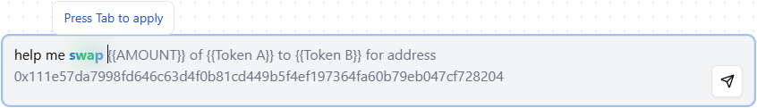
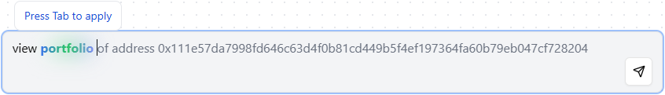

# FlyFish Chat 🐟

[](https://github.com/Weminal-labs)
[](https://x.com/0xFlyFish_agent)

FlyFish Chat is a frontend application that allows users to engage with **ElizaOS Agent** and **Atoma** in the background, which have been adjusted to provide some functionality such as interacting with some huge Generative AI (fits with Web3), swapping, transferring tokens, etc.

<p align="center">
  <a href="https://gitpoint.co/">
    
  </a>
</p>

#### Launch Demo🌈: [FlyFish Chat Demo](https://flyfish-chat.vercel.app/)

## Table of Contents

- [FlyFish Chat 🐟](#flyfish-chat-) - [Launch Demo🌈: FlyFish Chat Demo](#launch-demo-flyfish-chat-demo)
- [Table of Contents](#table-of-contents)
- [Overview](#overview)
- [Features](#features)
- [Project Structure](#project-structure)
- [Interaction with ElizaOS](#interaction-with-elizaos)
- [License](#license)

## Overview

This is a frontend repository that connects users to the Sui blockchain. The app facilitates:

- Allowing token swaping between SUI, USDC, USDT, ... with Eliza Agent's actions.
- Interacting with AI which is behind ElizaOS.
- Withdrawing tokens with ease.
- Integrating with Fly Crawler.

## Features

- **Interaction with Large Generative AI System (in Web3 Context)**: add description here.
- **Crawl Result Viewing**: add description here.
- **Using Customized ElizaOS Agent's Actions**: add description here.
  
  
- **Cross-token Swaps**: add description here.
- **User-friendly Interface**: add description here.

## Project Structure

```
.
├── public/
├── src/
│   ├── api/                                   # API Class, use to create API Caller instance for each object
│   ├── assets/
│   ├── components/                            # Reusable components/
│   │   ├── conversation                       # Chat components where user interacts with Agent/
│   │   │   └── conversation-section.tsx
│   │   └── swap/
│   │       └── swap.tsx                       # Swap box allows user interact easier
│   ├── hooks/
│   ├── layouts/
│   │   └── dashboard.tsx                      # A  user-friendly layout
│   ├── lib/
│   ├── objects/                               # Inspired by Object Oriented Programming, use to interact with objects in the system/
│   │   ├── conversation
│   │   └── token
│   ├── pages/
│   ├── routes/
│   ├── states/                                # State management with Zustand/
│   │   └── conversation
│   ├── types/
│   ├── utils/
│   │   └── tusky                              # Interact with Tusky/
│   │       └── index.ts
│   ├── App.css
│   ├── App.tsx
│   ├── index.css
│   └── main.tsx
├── vite-env.d.ts
├── wallet-custom.css
├── README.md
├── components.json
├── eslint.config.js
├── index.html
├── package.json
├── postcss.config.js
├── tailwind.config.js
├── tsconfig.app.json
├── tsconfig.json
├── tsconfig.node.json
├── tsconfig.paths.json
├── vite.config.ts
└── LICENSE
```

## Interaction with ElizaOS

**INSERT IMAGE HERE**

## License

This project is licensed under the MIT License - see the LICENSE file for details.
